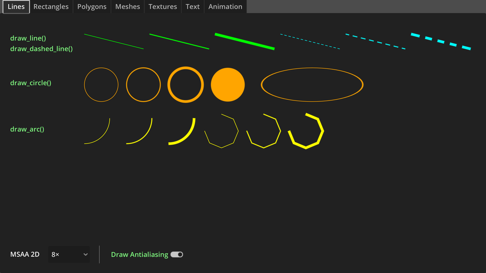

# Custom drawing in 2D

A demo showing how to draw 2D elements in Godot without using nodes. This can be done
to create procedural graphics, perform debug drawing to help troubleshoot issues in
game logic, or to improve performance by not creating a node for every visible element.

Antialiasing can be performed using two approaches: either by enabling the `antialiasing`
parameter provided by some of the CanvasItem `draw_*` methods, or by enabling 2D MSAA
in the Project Settings. 2D MSAA is generally slower, but it works with any kind of line-based
or polygon-based 2D drawing, even for `draw_*` methods that don't support an `antialiasing`
parameter. Note that 2D MSAA is only available in the Forward+ and Mobile
renderers, not Compatibility.

See [Custom drawing in 2D](https://docs.godotengine.org/en/latest/tutorials/2d/custom_drawing_in_2d.html)
in the documentation for more information.

Language: GDScript

Renderer: Mobile

## Screenshots

