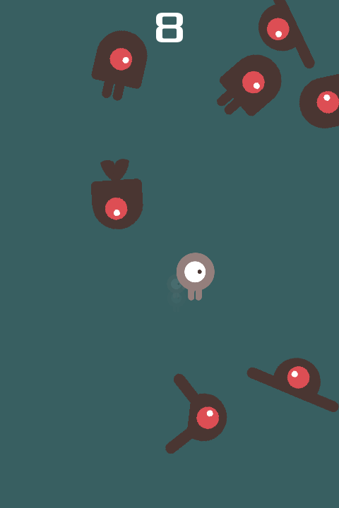

# Dodge the Creeps

This is a simple game where your character must move
and avoid the enemies for as long as possible.

This is a finished version of the game featured in the
["Your first 2D game"](https://docs.godotengine.org/en/latest/getting_started/first_2d_game/index.html)
tutorial in the documentation. For more details,
consider following the tutorial in the documentation.

Language: GDScript

Renderer: Compatibility

Note: There is a C# version available [here](https://github.com/godotengine/godot-demo-projects/tree/master/mono/dodge_the_creeps).

Check out this demo on the asset library: https://godotengine.org/asset-library/asset/2712

## Screenshots

## Copying

`art/House In a Forest Loop.ogg` Copyright &copy; 2012 [HorrorPen](https://opengameart.org/users/horrorpen), [CC-BY 3.0: Attribution](http://creativecommons.org/licenses/by/3.0/). Source: https://opengameart.org/content/loop-house-in-a-forest

Images are from "Abstract Platformer". Created in 2016 by kenney.nl, [CC0 1.0 Universal](http://creativecommons.org/publicdomain/zero/1.0/). Source: https://www.kenney.nl/assets/abstract-platformer

Font is "Xolonium". Copyright &copy; 2011-2016 Severin Meyer <sev.ch@web.de>, with Reserved Font Name Xolonium, SIL open font license version 1.1. Details are in `fonts/LICENSE.txt`.
