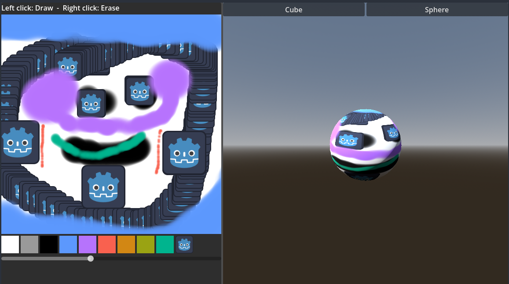

# Drawable Texture

This is a simple demo in which you can paint using a DrawableTexture which got introduced in Godot 4.7. The code shows how to draw on the texture and the same texture is being copied to a sphere and cube mesh to give a better example of how it can be used ingame.

Language: GDScript

Renderer: Compatibility

## Screenshots

