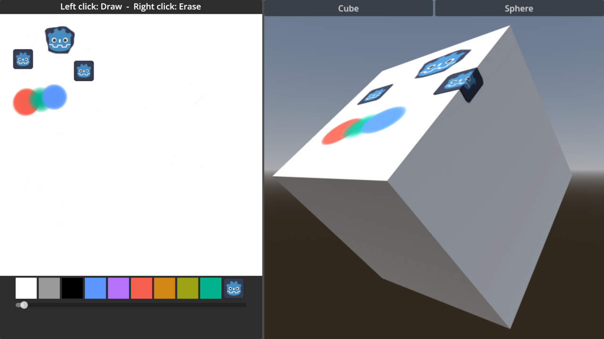

# Drawable Textures

This is a simple demo in which you can paint using a
[DrawableTexture](https://docs.godotengine.org/en/stable/tutorials/rendering/drawable_textures.html).

The code shows how to draw on the texture, and the same texture is being copied
to a sphere and cube mesh to give a better example of how it can be used in-game.

Language: GDScript

Renderer: Compatibility

Check out this demo on the Asset Store: https://store.godotengine.org/asset/godot-foundation/drawable-textures-demo/

## Screenshots

