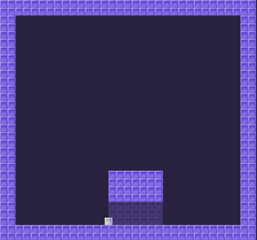

# Dynamic TileMap Layers

Example of how to make a fake wall using TileMap's
`_tile_data_runtime_update()` method. It shows how
to disable collisions per layer.

Language: GDScript

Renderer: Compatibility

## Screenshots

