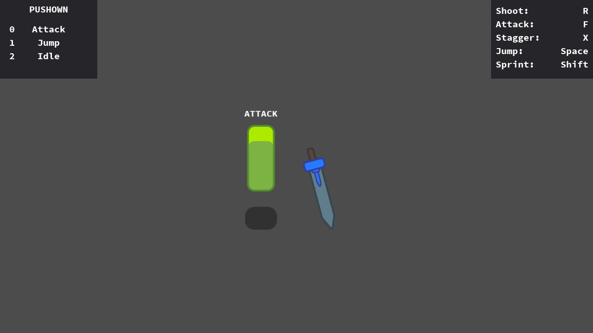

# Hierarchical Finite State Machine

This example shows how to apply the State machine programming
pattern in GDscript, including Hierarchical States, and a
pushdown automaton.

Language: GDScript

Renderer: Compatibility

Check out this demo on the asset library: https://godotengine.org/asset-library/asset/2714

## Why use a state machine

States are common in games. You can use the pattern to:

1. Separate each behavior and transitions between behaviors,
   thus make scripts shorter and easier to manage.

2. Respect the Single Responsibility Principle.
   Each State object represents one action.

3. Improve your code's structure. Look at the scene tree and
   FileSystem tab: without looking at the code, you'll know
   what the Player can or cannot do.

You can read more about States in the excellent
[Game Programming Patterns ebook](https://gameprogrammingpatterns.com/state.html).

## Screenshots

