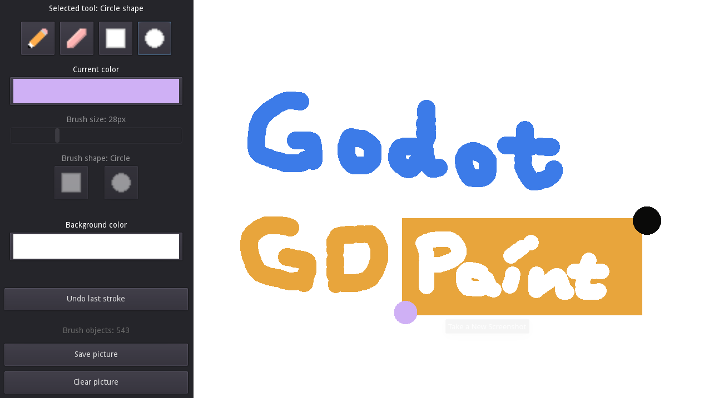

# GD Paint update for godot 4 from godot 3

GD Paint is a simple image editor made using Godot and GDScript.
It supports different types of "brushes": a basic pen/pencil
and eraser, as well as a rectangle and a circle brush.

Language: GDScript

Renderer: GLES 2

Check out this demo on the asset library: https://godotengine.org/asset-library/asset/517

## Screenshots

