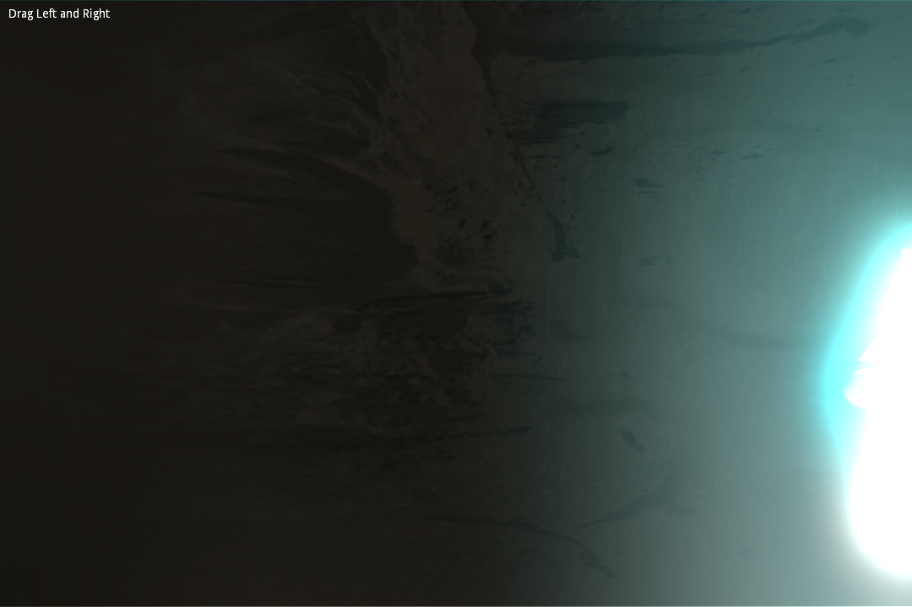

# Glow for 2D

This showcases how to use glow in a 2D game via the WorldEnvironment node.

Slide the cave image left and right to observe the glow effect at work.

Language: GDScript

Renderer: Forward+

Check out this demo on the asset library: https://godotengine.org/asset-library/asset/2715

## Screenshots

