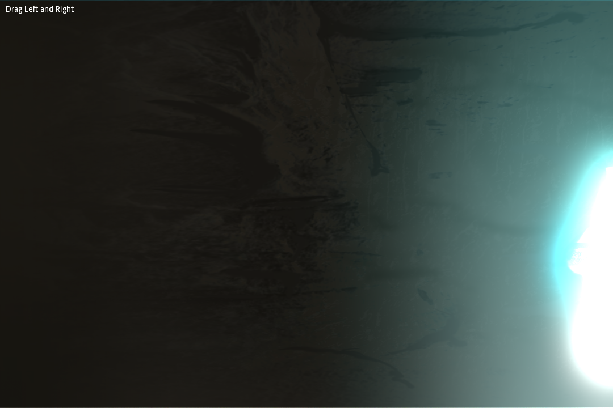
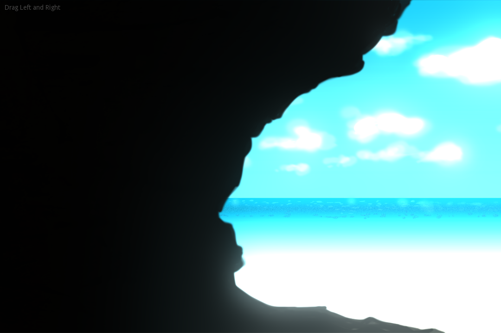

# Glow for 2D

This showcases how to use glow in a 2D game via the WorldEnvironment node.

Slide the cave image left and right to observe the glow effect at work. Press <kbd>G</kbd>
to toggle the glow map (lens dirt) effect.

The Label is on a separate CanvasLayer, so that it is not affected by glow.

Language: GDScript

Renderer: Mobile

Check out this demo on the Asset Store: https://store.godotengine.org/asset/godot-foundation/glow-for-2d-demo/

## Screenshots

