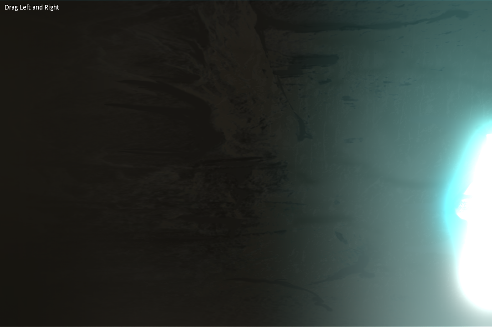
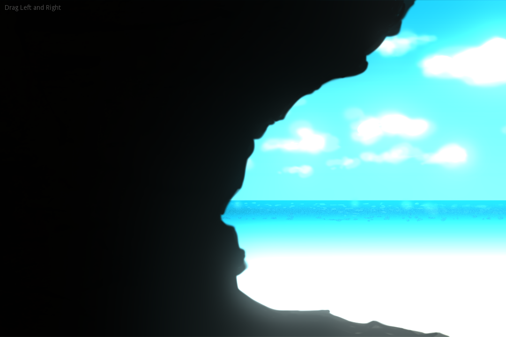

# HDR for 2D

Simple demo how to use High Dynamic Range (HDR) in a 2D game,
via the WorldEnvironment node.

Just slide the cave image left and right to observe the HDR effect at work.

Language: GDScript

Renderer: GLES 3 (HDR is not available in GLES 2)

Check out this demo on the asset library: https://godotengine.org/asset-library/asset/110

## Screenshots

