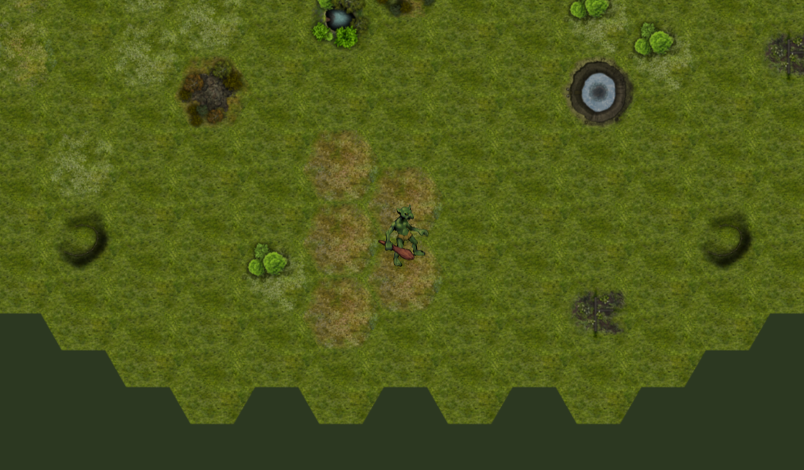

# Hexagonal Game

Very simple demo showing a hexagonal TileMap and TileSet.

Language: GDScript

Renderer: GLES 2

Check out this demo on the asset library: https://godotengine.org/asset-library/asset/111

## Screenshots

