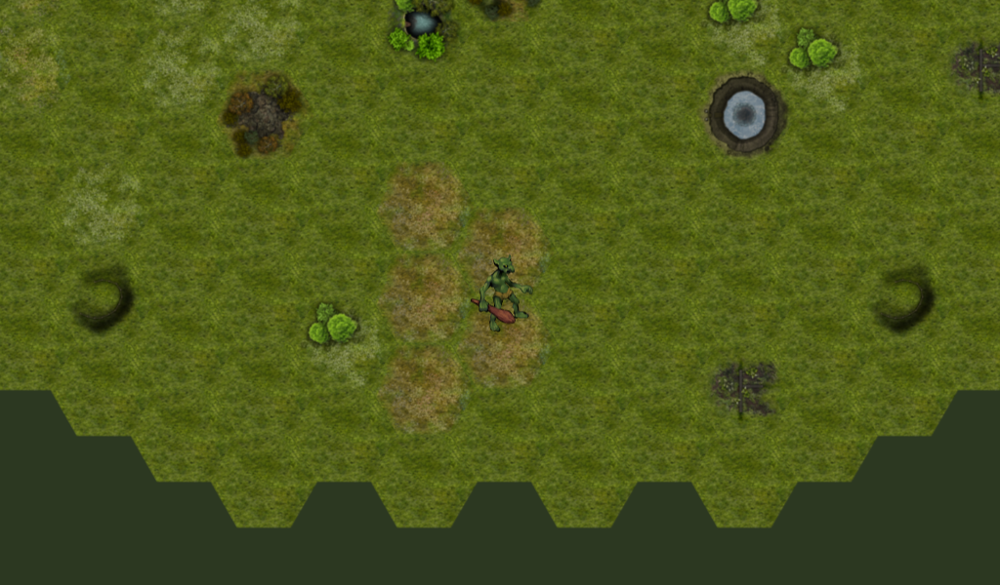

# Hexagonal Game

Very simple demo showing a hexagonal TileMap and TileSet.

Language: GDScript

Renderer: Compatibility

Check out this demo on the Asset Store: https://store.godotengine.org/asset/godot-foundation/hexagonal-game-demo/

## Screenshots

