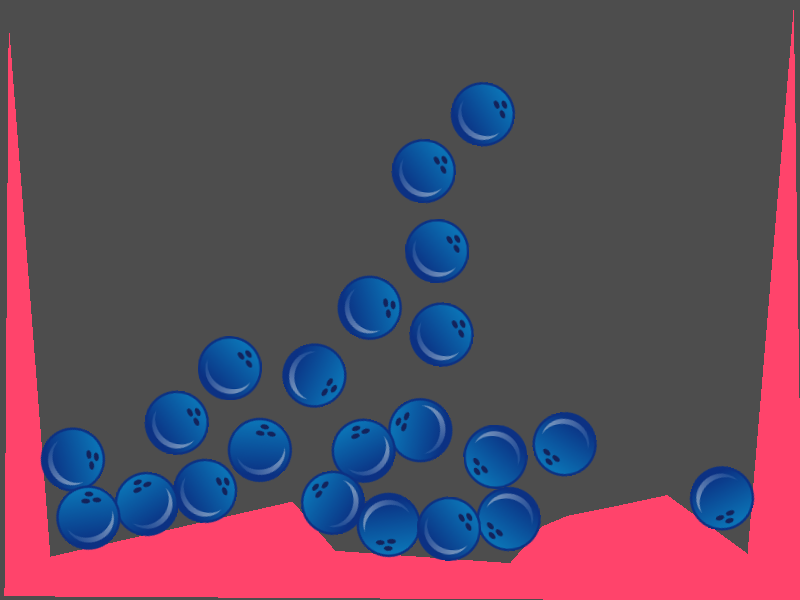

# Instancing Demo

A demo showing how to use scene instancing to
make many duplicates of the same object.

Language: GDScript

Renderer: GLES 2

Check out this demo on the asset library: https://godotengine.org/asset-library/asset/148

## Screenshots

