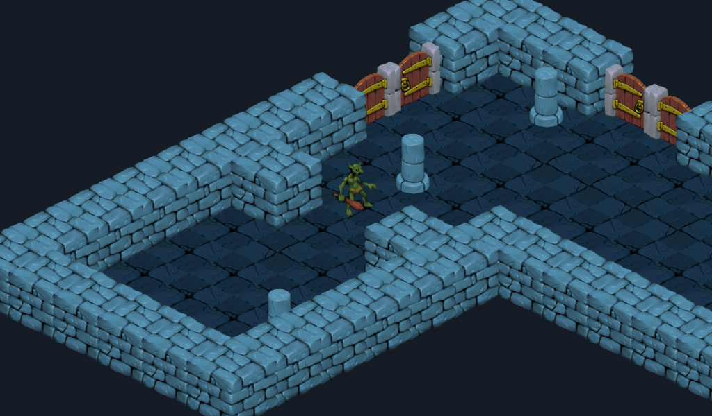

# Isometric Game

This demo shows a traditional isometric view with depth sorting.

A character can move around the level and will also slide around objects,
as well as be occluded when standing in front or behind them.

Language: GDScript

Renderer: GLES 2

Check out this demo on the asset library: https://godotengine.org/asset-library/asset/112

## How does it work?

The level uses a [`TileMap`](https://docs.godotengine.org/en/latest/classes/class_tilemap.html#class-tilemap)
in which the tiles have different vertical offsets.
The walls, doors, and pillars each have
[`StaticBody2D`](https://docs.godotengine.org/en/latest/classes/class_staticbody2d.html)
and [`CollisionPolygon2D`](https://docs.godotengine.org/en/latest/classes/class_collisionpolygon2d.html)
at their base. The player also has a collider at its base,
which makes the player collide with the level.

## Screenshots

