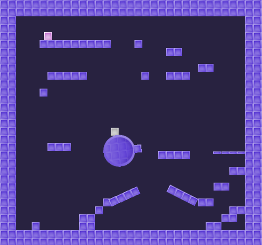

# Kinematic Character 2D

Example of how to make a kinematic character controller in 2D using
[`CharacterBody2D`](https://docs.godotengine.org/en/latest/classes/class_characterbody2d.html).
The character moves around, is affected by moving platforms,
can jump through one-way collision platforms, etc.

Language: GDScript

Renderer: Compatibility

Check out this demo on the asset library: https://godotengine.org/asset-library/asset/2719

## Screenshots

