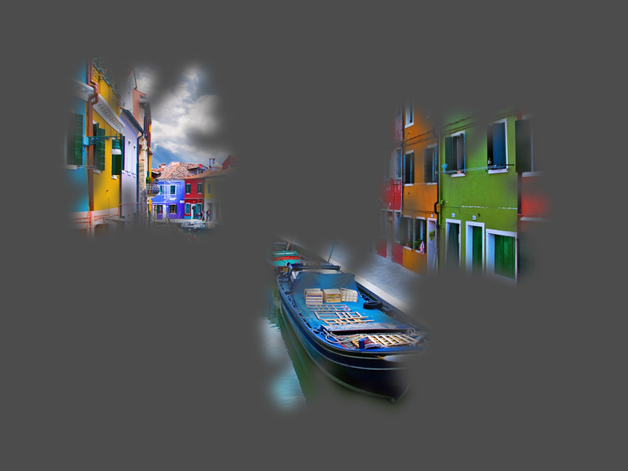

# 2D Lights as Mask

Example of how to use 2D lights to mask objects on screen.

Language: GDScript

Renderer: GLES 2

Check out this demo on the asset library: https://godotengine.org/asset-library/asset/115

## Screenshots

