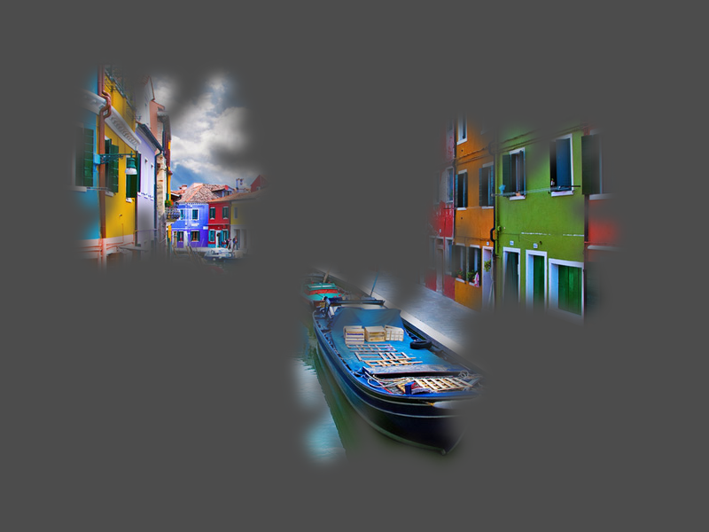

# 2D Lights as Mask

Example of how to use 2D lights to mask objects on screen.

Language: GDScript

Renderer: Compatibility

Check out this demo on the Asset Store: https://store.godotengine.org/asset/godot-foundation/light2d-as-mask-demo/

## Screenshots

