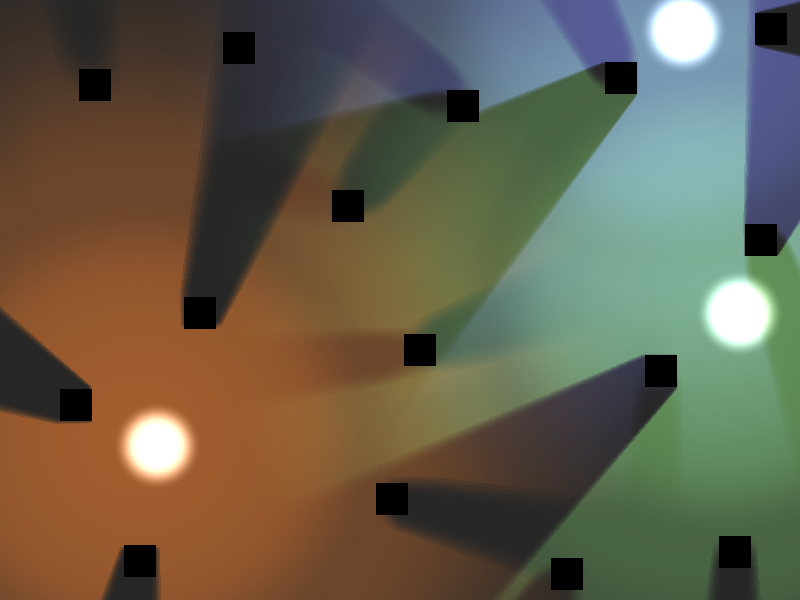

# 2D Lights and Shadows

Simple demo of 2D lights and shadows, using
[`Light2D`](https://docs.godotengine.org/en/latest/classes/class_light2d.html)
and [`LightOccluder2D`](https://docs.godotengine.org/en/latest/classes/class_lightoccluder2d.html).

Language: GDScript

Renderer: GLES 2

Check out this demo on the asset library: https://godotengine.org/asset-library/asset/116

## Screenshots

