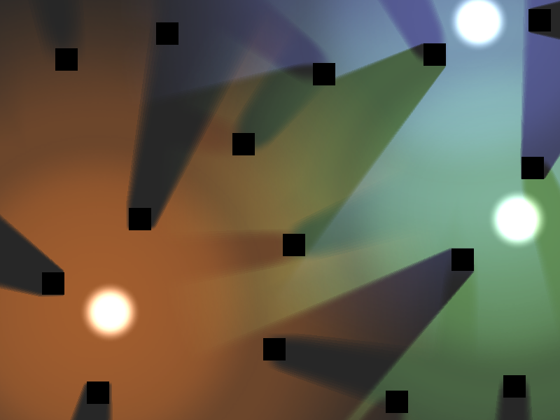

# 2D Lights and Shadows

Simple demo of 2D lights and shadows, using
[`Light2D`](https://docs.godotengine.org/en/latest/classes/class_light2d.html)
and [`LightOccluder2D`](https://docs.godotengine.org/en/latest/classes/class_lightoccluder2d.html).

Language: GDScript

Renderer: Compatibility

Check out this demo on the Asset Store: https://store.godotengine.org/asset/godot-foundation/lights-and-shadows-2d-demo/

## Screenshots

