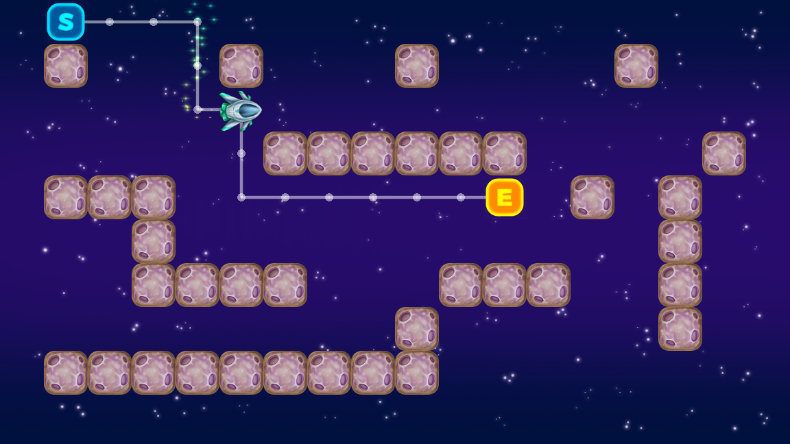

# Grid-based Navigation with AStarGrid2D

This is an example of using AStarGrid2D for navigation in 2D,
complete with Steering Behaviors in order to smooth the movement out.

Language: GDScript

Renderer: Compatibility

Check out this demo on the asset library: https://godotengine.org/asset-library/asset/2723

## Screenshots

