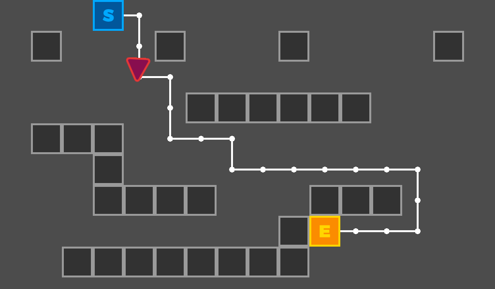

# Grid-based Navigation with Astar

This is an example of using AStar for navigation in 2D,
complete with Steering Behaviors in order to smooth the movement out.

Language: GDScript

Renderer: GLES 2

## Screenshots

