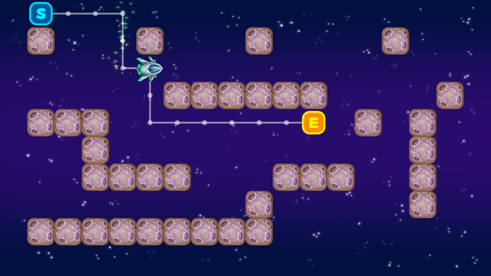

# Grid-based Navigation with AStarGrid2D

This is an example of using AStarGrid2D for navigation in 2D,
complete with Steering Behaviors in order to smooth the movement out.

Language: GDScript

Renderer: Compatibility

Check out this demo on the Asset Store: https://store.godotengine.org/asset/godot-foundation/grid-based-navigation-with-astargrid2d-demo/

## Screenshots

