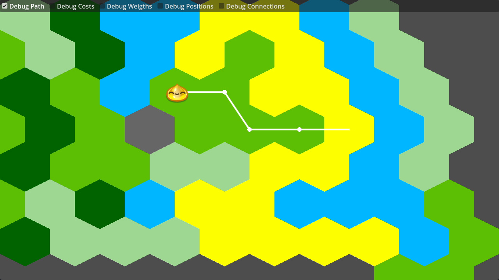

# Tile-based navigation on hexagonal Tilemap (2D)

Example of using 2D navigation (tile based) on a hexagonal map, using :
- [`TileMap`](https://docs.godotengine.org/en/stable/classes/class_tilemap.html)
- [`AStar2D`](https://docs.godotengine.org/en/stable/classes/class_astar2d.html)

Language: GDScript

Renderer: Compatibility

Use mouse left click to interact.

## Screenshots

