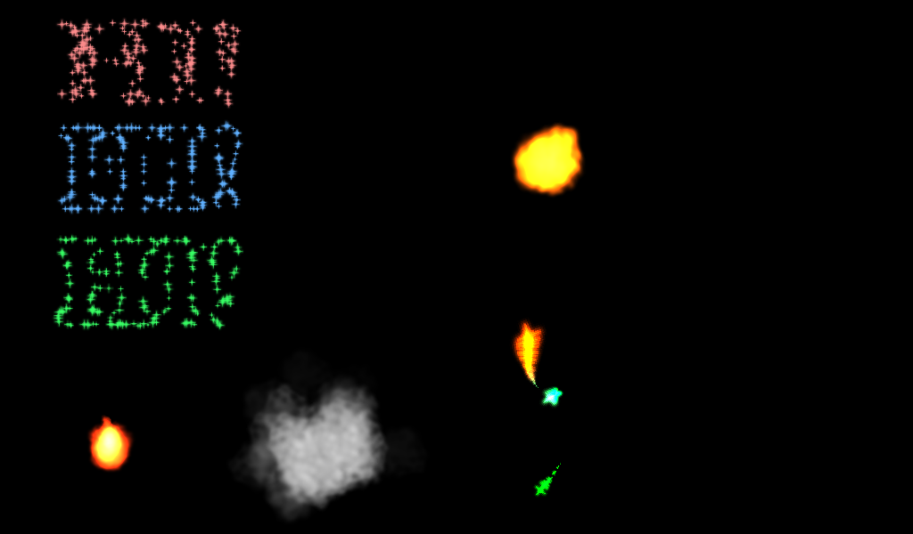

# 2D Particles

This demo showcases how 2D particle systems work in Godot.

Language: GDScript

Renderer: GLES 3 (particles are not available in GLES 2)

Check out this demo on the asset library: https://godotengine.org/asset-library/asset/118

## How does it work?

It uses [`Particles2D`](https://docs.godotengine.org/en/latest/classes/class_particles2d.html) nodes
with [`ParticlesMaterial`](https://docs.godotengine.org/en/latest/classes/class_particlesmaterial.html)
materials. Note that `ParticlesMaterial` is agnostic between 2D and 3D,
so when used in 2D, the "Disable Z" flag should be enabled.

## Screenshots

