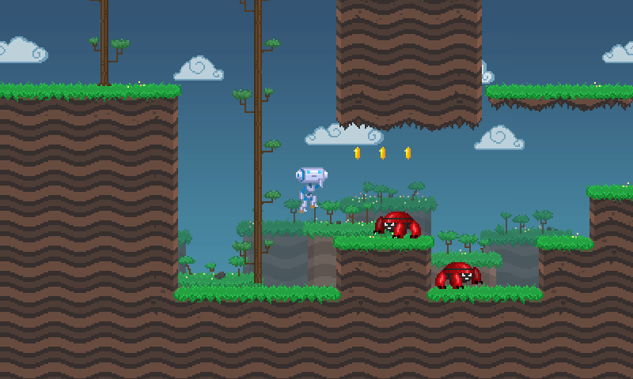
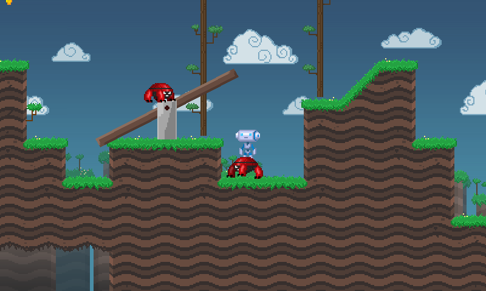

# Physics Platformer

This demo uses [`RigidBody2D`](https://docs.godotengine.org/en/latest/classes/class_rigidbody2d.html)
for the player and enemies.
These character controllers are more powerful than
[`CharacterBody2D`](https://docs.godotengine.org/en/latest/classes/class_characterbody2d.html),
but can be more difficult to handle, as they require
manual modification of the RigidDynamicBody velocity.

Language: GDScript

Renderer: Forward+

Check out this demo on the asset library: https://godotengine.org/asset-library/asset/2725

## How does it work?

The player and enemies use dynamic character
controllers for movement, made with
[`RigidBody2D`](https://docs.godotengine.org/en/latest/classes/class_rigidbody2d.html),
which means that they can perfectly interact with physics
(there is a see-saw, and you can even ride enemies).
Because of this, all movement must be done in sync with
the physics engine, inside of `_integrate_forces()`.

## Screenshots

## Music

"Pompy" by Hubert Lamontagne (madbr) https://soundcloud.com/madbr/pompy
