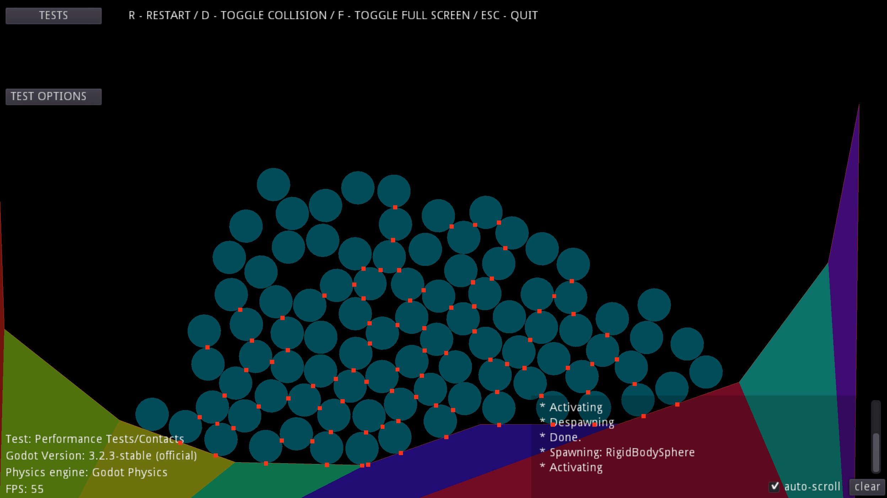

# 2D Physics Tests

This demo contains a series of tests for the 2D
physics engine.

They can be used for different purpose:

- Functional tests to check for regressions and
  behavior of the 2D physics engine
- Performance tests to evaluate performance
  of the 2D physics engine

Language: GDScript

Renderer: Compatibility

Check out this demo on the asset library: https://godotengine.org/asset-library/asset/2726

## Screenshots

