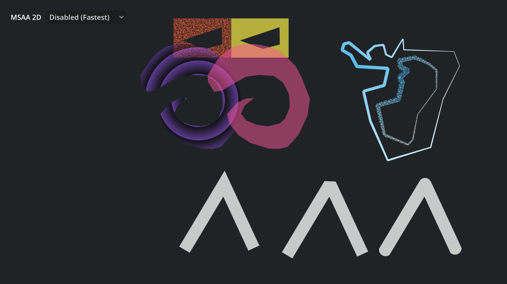

# 2D Polygons and Lines

A demo of solid and textured 2D polygons and lines using
[Polygon2D](https://docs.godotengine.org/en/stable/classes/class_polygon2d.html) and
[Line2D](https://docs.godotengine.org/en/stable/classes/class_line2d.html).

In this project, solid Line2Ds are antialiased by using a specially crafted texture.
By using a texture that is solid white on all its pixels except the top and bottom edges
(which are fully transparent white), the border appears smooth thanks to bilinear filtering.
A more extensive variation of this concept (which works better with variable-width lines) can be found
in the unofficial
[Antialiased Line2D add-on](https://github.com/godot-extended-libraries/godot-antialiased-line2d).

2D multisample antialiasing (MSAA) is also supported when using the Forward+ and Mobile rendering
methods. This is a slower approach, but it works on all 2D drawing performed within the viewport,
including Polygon2D nodes or [custom drawing](https://docs.godotengine.org/en/stable/tutorials/2d/custom_drawing_in_2d.html).
This approach can be used at the same time as the aforementioned Line2D antialiasing technique.

Language: GDScript

Renderer: Mobile

## Screenshots

