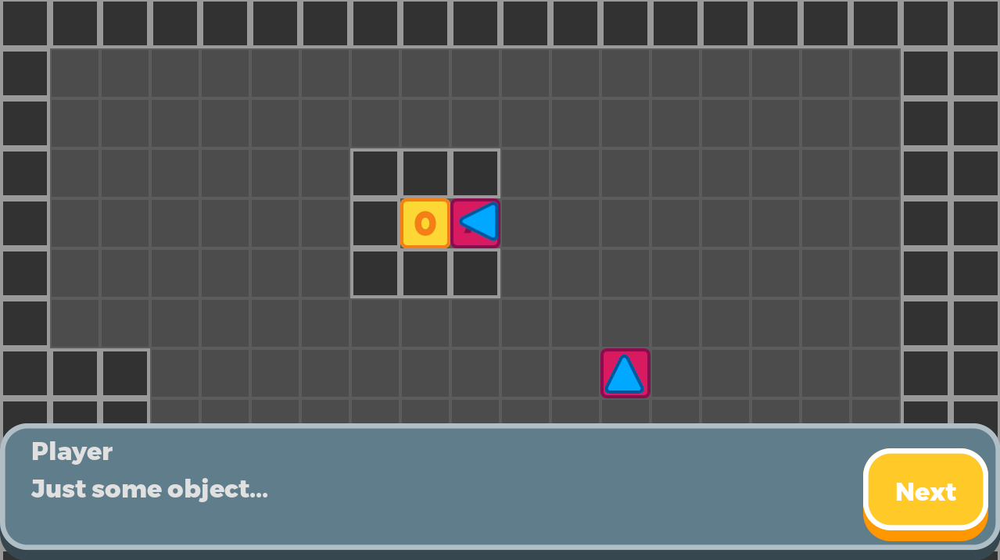
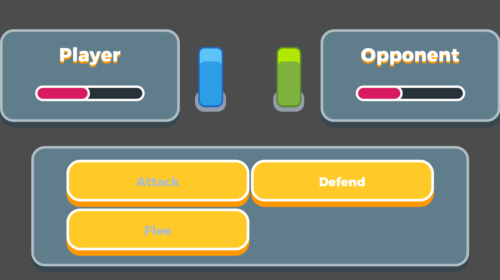

# Role Playing Game

This shows a method of creating grid-based movement with Godot
and GDScript. It also includes a simple JRPG-style dialogue and
battle system on top of it.

Language: GDScript

Renderer: GLES 2

Check out this demo on the asset library: https://godotengine.org/asset-library/asset/520

## Screenshots

