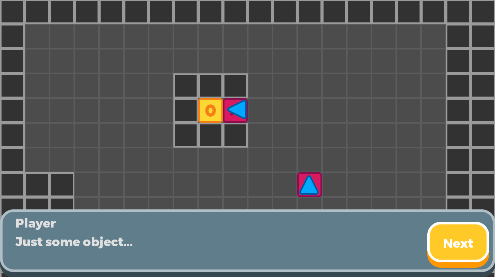
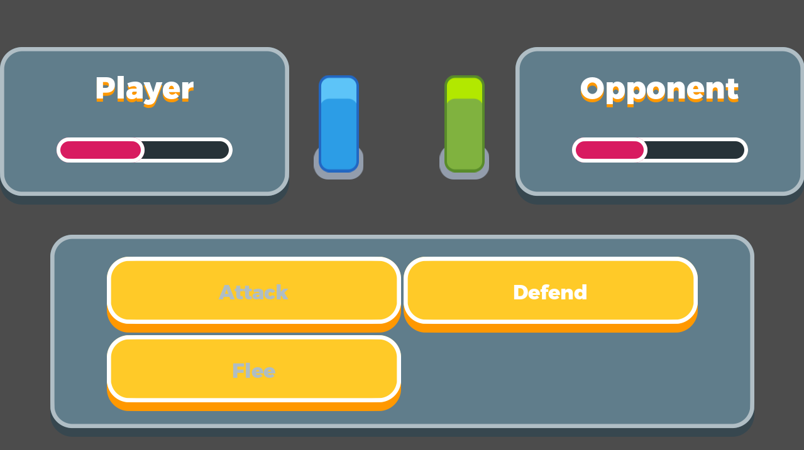

# Role Playing Game

This shows a method of creating grid-based movement with Godot
and GDScript. It also includes a simple JRPG-style dialogue and
battle system on top of it.

Language: GDScript

Renderer: Compatibility

Check out this demo on the Asset Store: https://store.godotengine.org/asset/godot-foundation/role-playing-game-demo/

## Screenshots

