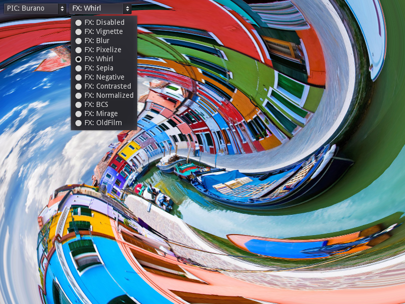
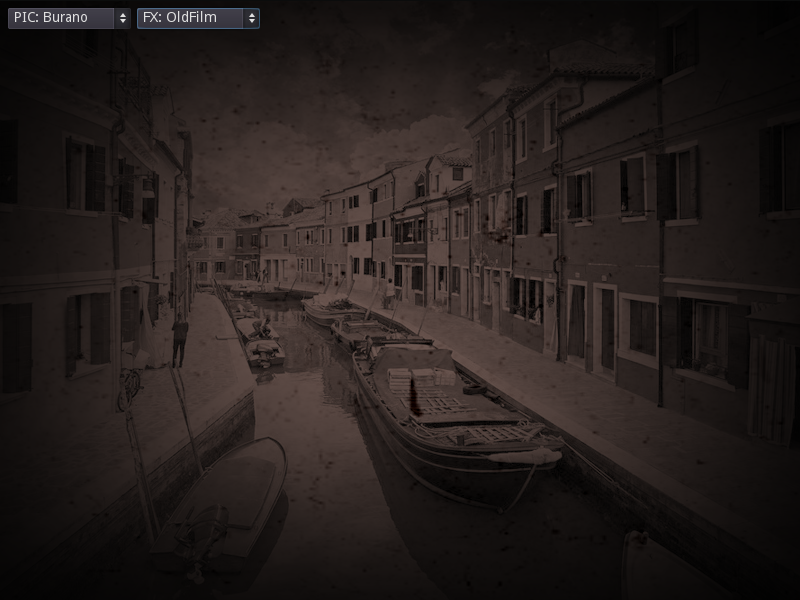

# Screen Space Shaders

Several examples of full screen 2D shader processing.
Many common full-res effects are implemented here for reference.

Language: [Godot shader language](https://docs.godotengine.org/en/latest/tutorials/shaders/shader_reference/shading_language.html) and GDScript

Renderer: Compatibility

Check out this demo on the Asset Store: https://store.godotengine.org/asset/godot-foundation/screen-space-shaders-demo/

## Screenshots

