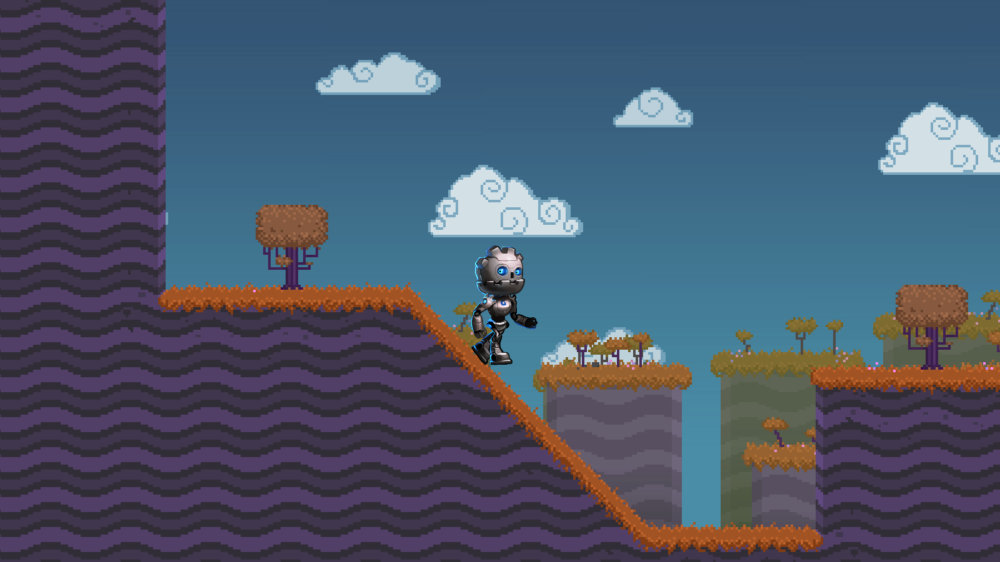

# Skeleton2D Demo

This demo shows how to create a rigged and animated character in 2D using
Godot's Skeleton2D node. There are several movement-related animations and
there is a simple character controller that controls the animations.

Language: GDScript

Renderer: GLES 2

Check out this demo on the asset library: https://godotengine.org/asset-library/asset/1027

## Licenses

GBot character Copyright &copy; circa 2020 Andreas Esau, MIT License.

Initial rigging and animating Copyright &copy; 2020 RustyStriker, MIT License.

## Screenshots

