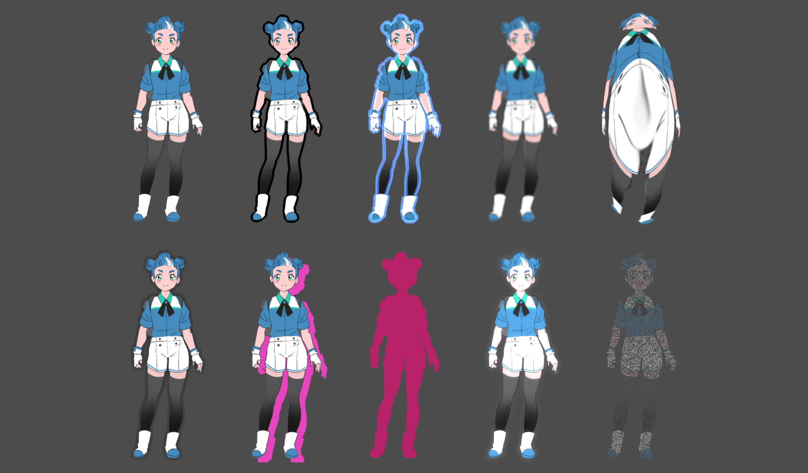

# Sprite Shaders

This is a sample consisting of different shaders applied to some sprites.
Effects include outlines, blurs, distorts, shadows, glows, and more.

Language: [Godot shader language](https://docs.godotengine.org/en/latest/tutorials/shaders/shader_reference/shading_language.html)

Renderer: Compatibility

Check out this demo on the asset library: https://godotengine.org/asset-library/asset/2732

## Screenshots

