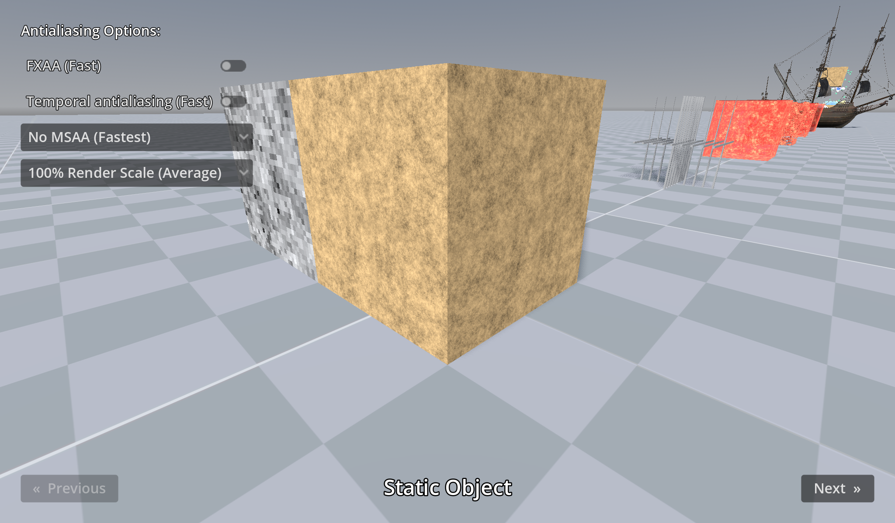

# 3D Anti-Aliasing

This project showcases the various 3D antialiasing techniques supported by Godot.

- **Multisample antialiasing (MSAA):** High quality, high performance cost.
  Does not blur the image.
  - Does not affect shader-induced aliasing (such as specular aliasing) or alpha
	scissor materials, so these will remain aliased.
- **Fast approximate antialiasing (FXAA):** Medium quality, low performance cost.
  Slightly blurs the image.
- **Temporal antialiasing (TAA):** High-quality, low performance cost. Slightly
  blurs the image (but less so than FXAA).
  - Antialiasing quality is worse on fast-moving objects than other methods,
	especially at lower framerates since the TAA won't have enough time to
	converge on those objects.
  - Can introduce ghosting artifacts on moving objects, especially if motion
	vectors are not correctly generated from a given material shader.
- **Supersampling (SSAA):** The highest-quality technique, but also the most
  expensive. Does not blur the image.
  - 200% resolution scale is equivalent to 4× SSAA, as each dimension is
	doubled. For example, if running in a 1920×1080 window at 200% render scale,
	the 3D framebuffer will be 3840×2160.
  - SSAA can be used together with FXAA or TAA to counter the blurring added by
	those algorithms, while further improving antialiasing quality.

Godot allows using multiple antialiasing techniques at the same time. This can
be useful to obtain the best possible quality, or to find a better performance
tradeoff.

Language: GDScript

Renderer: Vulkan Clustered

## Screenshots

## Licenses

Files in the `polyhaven/` folder are downloaded from <https://polyhaven.com/a/dutch_ship_medium>
and are licensed under CC0 1.0 Universal.
