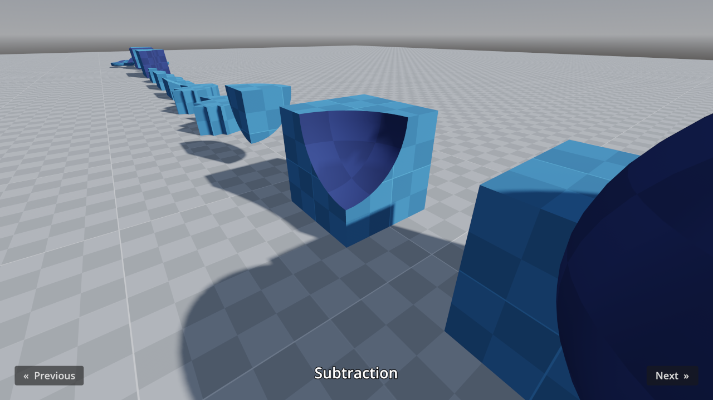

# Constructive Solid Geometry (CSG)

This project showcases the various constructive solid geometry features supported by Godot.

CSG can be used to [prototype level designs within the 3D editor](https://docs.godotengine.org/en/stable/tutorials/3d/csg_tools.html).

Language: GDScript

Renderer: Forward+

Check out this demo on the asset library: https://godotengine.org/asset-library/asset/2735

## Screenshots

