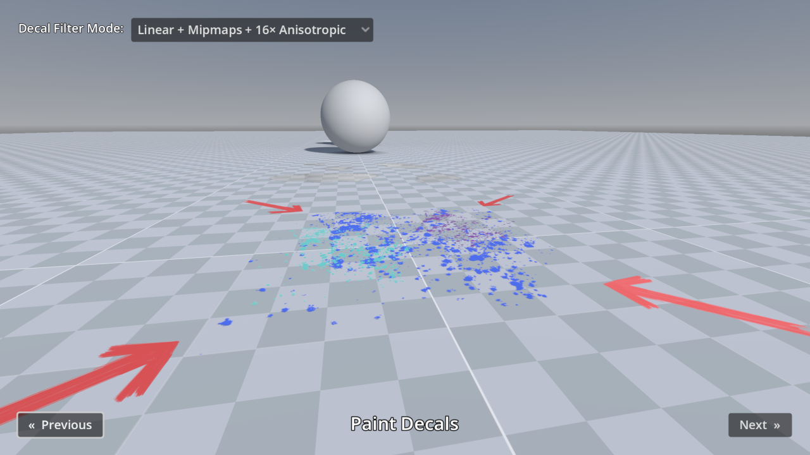

# Decals

This demo includes many examples of Decal nodes in action,
for the purpose of showcasing Godot's rendering capabilities.

The decal filter mode can be adjusted in the top-left corner:

- For games with a pixel art appearance, the Nearest filter mode can be used
  instead of Linear.
- Filter modes with Mipmaps prevent decals from looking grainy at a distance, at
  a small performance cost. When mipmaps are used without anisotropic filtering,
  decals will look blurry when viewed at oblique angles.
- Filter modes with Anisotropic don't look grainy at a distance and also avoid
  looking blurry when viewed at oblique angles. However, filter modes with
  Anisotropic have a greater performance cost than enabling Mipmaps alone.

Language: GDScript

Renderer: Forward+

Check out this demo on the asset library: https://godotengine.org/asset-library/asset/2736

## Screenshots

