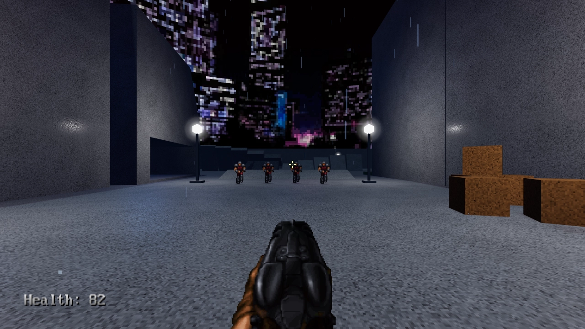

# First-Person Shooter

This is a demo implementing a retro-styled first-person shooter with a 2.5D
aesthetic (level is 3D, but enemies are 2D sprites).

Controls:

- Mouse, arrow keys or <kbd>Gamepad Right Stick</kbd>: Look around
- <kbd>W</kbd>, <kbd>Gamepad Left Stick</kbd>: Move forward
- <kbd>S</kbd>, <kbd>Gamepad Left Stick</kbd>: Move backward
- <kbd>A</kbd>, <kbd>Gamepad Left Stick</kbd>: Move left
- <kbd>D</kbd>, <kbd>Gamepad Left Stick</kbd>: Move right
- <kbd>Space</kbd>, <kbd>Right mouse button</kbd>, <kbd>Gamepad A/Cross</kbd>: Jump
- <kbd>Left mouse button</kbd>, <kbd>Gamepad Right Trigger</kbd>: Attack (or respawn if dead)
- <kbd>F</kbd>, <kbd>Thumb mouse buttons</kbd>, <kbd>Gamepad B/Circle</kbd>: Toggle flashlight
- <kbd>Escape</kbd>, <kbd>Gamepad D-Pad Up</kbd>: Quit

Language: GDScript

Renderer: Forward Plus

## How does it work?

The base vehicle uses a
[`VehicleBody`](https://docs.godotengine.org/en/latest/classes/class_vehiclebody.html)
node. The trailer truck is tied together using a
[`ConeJointTwist`](https://docs.godotengine.org/en/latest/classes/class_conetwistjoint.html)
node, and the tow truck is tried together using a chain made of
[`RigidBody`](https://docs.godotengine.org/en/latest/classes/class_rigidbody.html)
nodes which are pinned together using
[`PinJoint`](https://docs.godotengine.org/en/latest/classes/class_pinjoint.html) nodes.

## Screenshot

## License

- `player/shotgun/spritesheet.png`, `player/shotgun/*.wav` and
  `enemy/spritesheet.png` are Copyright © 2001-2022
  [Contributors to the Freedoom project](https://freedoom.github.io/)
  and are licensed under
  [3-clause BSD](https://github.com/freedoom/freedoom/blob/master/COPYING.adoc).
- `player/water_splash_in.ogg` and `player/water_splash_out.ogg` are Copyright ©
  2009-2019 [Red Eclipse Team](https://www.redeclipse.net/) and are licensed under
  [CC BY-SA 4.0](https://creativecommons.org/licenses/by-sa/4.0/)
- `player/rain.ogg` is
  [Copyright © Paul Hertz ("ignotus")](https://freesound.org/people/ignotus/sounds/14779/)
  and is licensed under
  [CC BY 3.0](https://creativecommons.org/licenses/by/3.0/).
- `fonts/vga-rom-font.png` is edited from
  <https://doomwiki.org/wiki/File:Vga-rom-font.png>, which is considered to be
  ineligible for copyright and therefore in the public domain.
