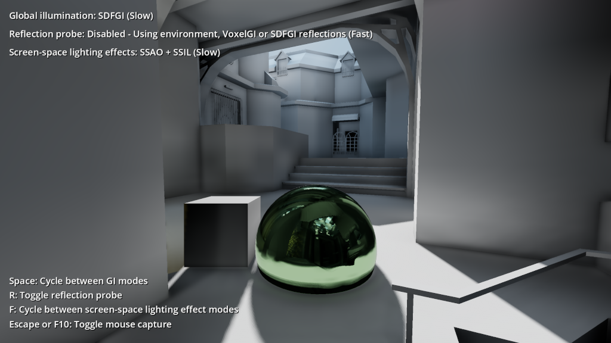

# Global Illumination

This demo showcases Godot's global illumination systems:
[GIProbe](https://docs.godotengine.org/en/stable/tutorials/3d/gi_probes.html),
[BakedLightmap](https://docs.godotengine.org/en/stable/tutorials/3d/baked_lightmaps.html)
(indirect only and fully baked) and
[ReflectionProbe](https://docs.godotengine.org/en/stable/tutorials/3d/reflection_probes.html).

Use the mouse to look around, <kbd>W</kbd>/<kbd>A</kbd>/<kbd>S</kbd>/<kbd>D</kbd>
or arrow keys to move.

Language: GDScript

Renderer: GLES 3[^1]

## How does it work?

A glTF scene (which acts as the level mesh) is imported with its **Light Baking**
option set to **Gen Lightmaps**.
This is required for BakedLightmap to work (but is not required for GIProbe
or BakedLightmap).

The level mesh is duplicated several times to allow displaying it with various bake settings:

- No baking (uses GIProbe or environment lighting).
- Baked indirect lighting. Slower, but allows for real-time shadows to display
  on baked surfaces.
- Baked direct *and* indirect lighting. Faster, but does not allow for real-time
  shadows to display on baked surfaces.

A sphere and box are parented to the camera to showcase dynamic object lighting.
A ReflectionProbe is parented to the sphere to showcase real-time reflections.
When the ReflectionProbe is hidden, it is disabled. In this case,
GIProbe or environment lighting will be used to provide fallback reflections.

## Screenshots

## Licenses

`zdm2.glb` is derived from the [Cube 2: Sauerbraten](http://sauerbraten.org/)
map "zdm2" and is
[licensed under CC BY 4.0 Unported](https://github.com/Calinou/game-maps-obj/blob/master/sauerbraten/zdm2.txt).
The OBJ file which it was converted from is available in the [game-maps-obj](https://github.com/Calinou/game-maps-obj) repository.

[^1]: This demo can be made to work with GLES2, but GIProbe will not work.
Additionally, lightmaps have to be rebaked with the **Atlas > Generate** property
disabled in BakedLightmap.
