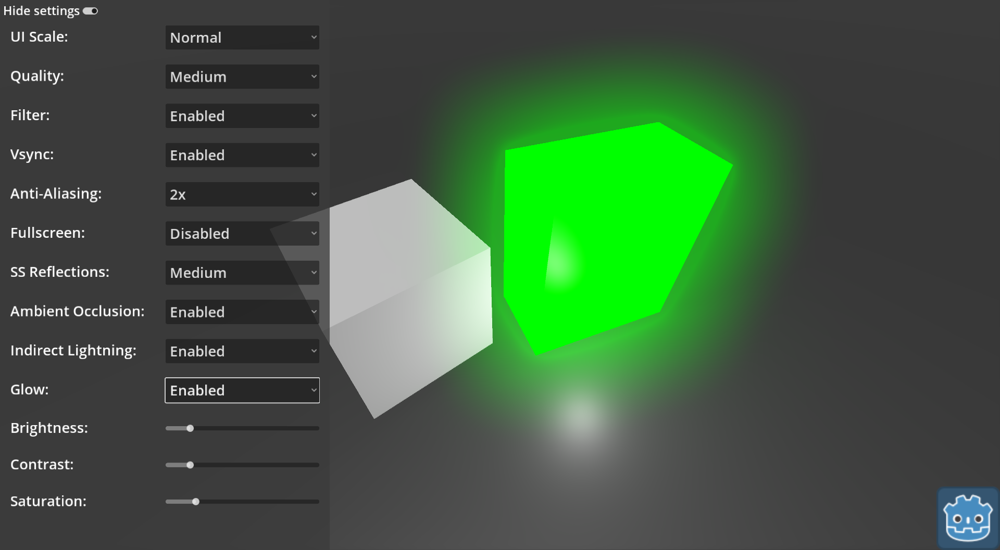

# 3D Settings Menu (Graphical Settings)

A demo showing an example of a settings menu.
Included settings are:
	- UI Scaling;
	- Render Quality;
	- Filter;
	- Vsync;
	- Anti-Aliasing;
	- Fullscreen;
	- Screen-Space Reflections;
	- Ambient Occlusion;
	- Indirect lightning;
	- Glow;
	- Brightness;
	- Contrast;
	- Saturation.

Language: GDScript

Renderer: Vulkan Clustered

## Screenshots

