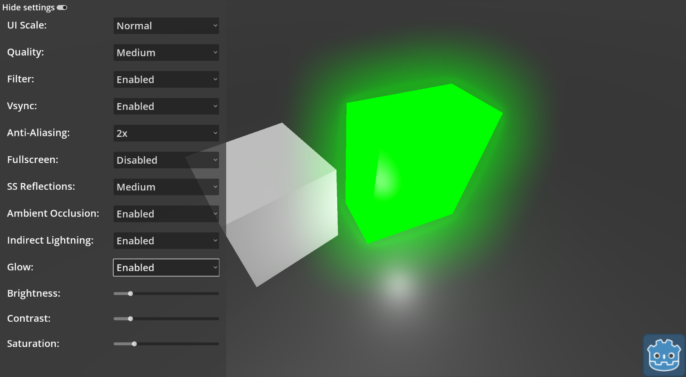

# 3D Graphics Settings

A demo showing an example of a graphics settings menu.

Included settings are:

**Video settings:**

- UI scale.
- Resolution scale.
- Display filter (bilinear, AMD FidelityFX Super Resolution 1.0 or 2.2).
- Fullscreen.
- V-Sync (traditional and adaptive).
- Anti-aliasing (MSAA, FXAA, SMAA, TAA).
- Camera field of view.

**Effect settings:**

- Signed distance field global illumination (SDFGI).
- Bloom (glow).
- Screen-space ambient occlusion (SSAO).
- Screen-Space reflections (SSR).
- Screen-space indirect lighting (SSIL).
- Volumetric fog.
- Screen adjustments: brightness, contrast, saturation.

Language: GDScript

Renderer: Forward+

Check out this demo on the Asset Store: https://store.godotengine.org/asset/godot-foundation/graphics-settings-3d-demo/

## Screenshots

