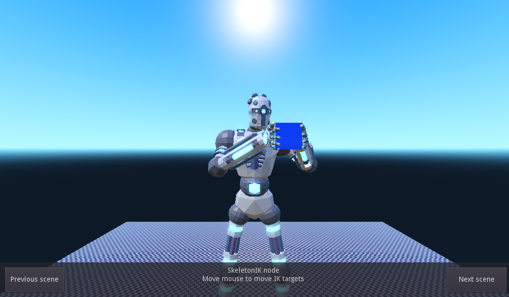
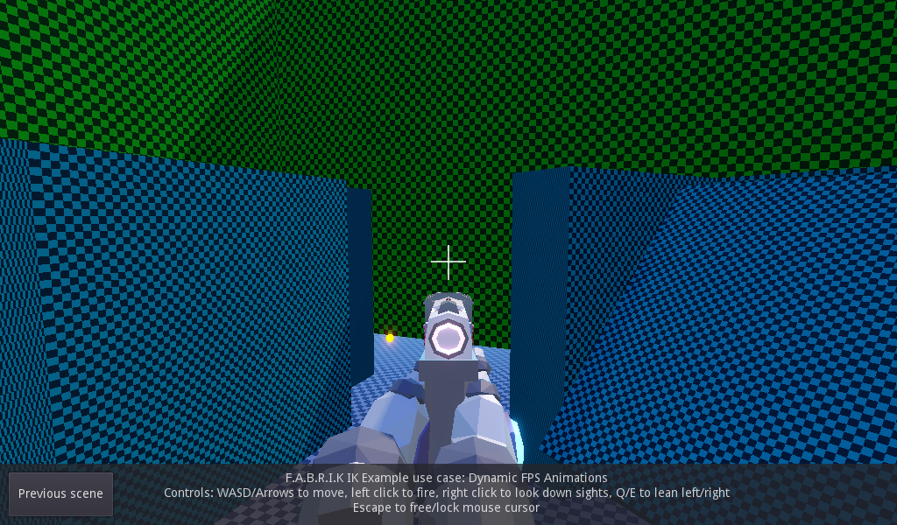

# 3D Inverse Kinematics

This is an example of different Inverse Kinematic algorithms
implemented in Godot. It contains four scenes, showing
different ways they can be used.

Language: GDScript

Renderer: Forward+

Check out this demo on the Asset Store: https://store.godotengine.org/asset/godot-foundation/inverse-kinematics-3d-demo/

## How does it work?

This demo shows how to implement IK using two different methods. One uses the
[`SkeletonIK3D`](https://docs.godotengine.org/en/latest/classes/class_skeletonik3d.html)
node which is built into Godot. The other method is using a script
called FABRIK (inside of the SADE plugin) for inverse kinematics.

## Screenshots

