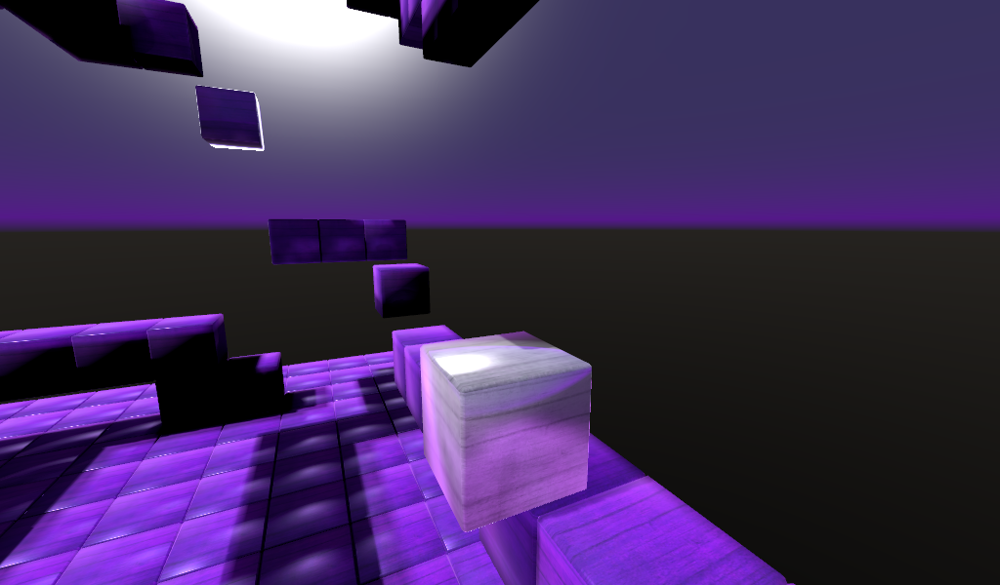
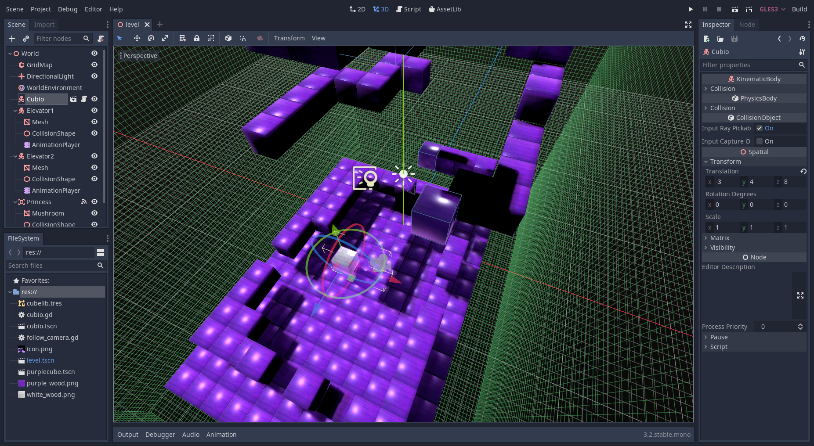

# Kinematic Character 3D

Kinematic character demo for 3D using a cube for the character.
This is similar to the 3D platformer demo.

Language: GDScript

Renderer: GLES 3

Check out this demo on the asset library: https://godotengine.org/asset-library/asset/126

## How does it work?

This demo uses a [`KinematicBody`](https://docs.godotengine.org/en/latest/classes/class_kinematicbody.html)
for the player, and [`StaticBody`](https://docs.godotengine.org/en/latest/classes/class_staticbody.html)
for the level. Each has colliders, the player moves itself via
`move_and_slide()` in `_physics_process()`, and collides with the level.

## Screenshots

