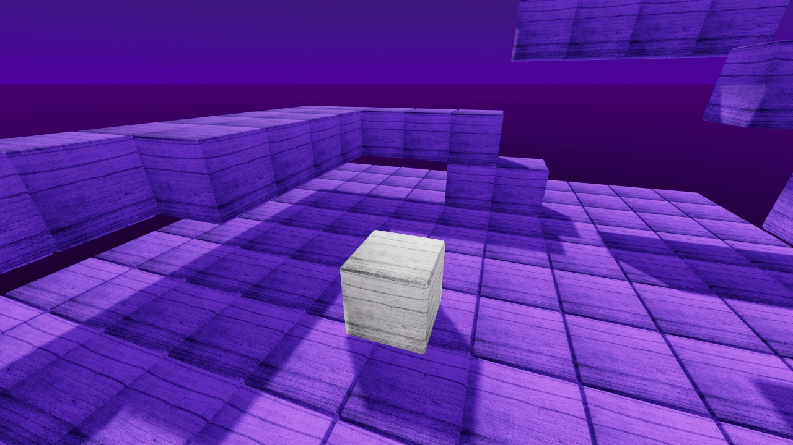

# Kinematic Character 3D

Kinematic character demo for 3D using a cube for the character.
This is similar to the 3D platformer demo.

Language: GDScript

Renderer: Forward+

Check out this demo on the asset library: https://godotengine.org/asset-library/asset/2739

## How does it work?

This demo uses a [`CharacterBody3D`](https://docs.godotengine.org/en/latest/classes/class_characterbody3d.html)
for the player, and [`StaticBody3D`](https://docs.godotengine.org/en/latest/classes/class_staticbody3d.html)
for the level. Each has colliders, the player moves itself via
`move_and_slide()` in `_physics_process()`, and collides with the level.

## Screenshots

