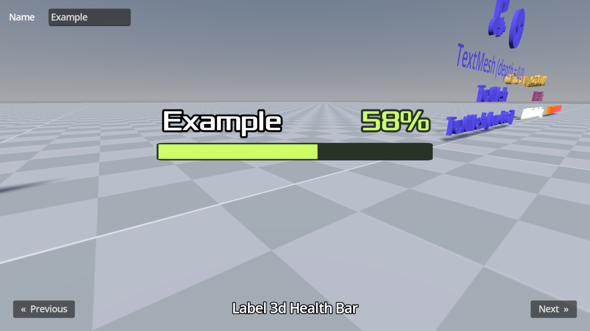

# 3D Labels and Texts

This project showcases the two main 3D text techniques supported by Godot:
Label3D and TextMesh.

Both Label3D and TextMesh exist in 3D space and can optionally be occluded by
other objects, but they serve different use cases.

**Label3D:** The Label3D node is a 3D node like any other. It draws text using
one quad per character, which can optionally be set to work as a billboard.

**TextMesh:** Unlike Label3D, TextMesh can optionally have actual depth since it
generates geometry to represent the text. TextMesh is not a node, but a
PrimitiveMesh resource you use within a MeshsInstance3D node. Therefore, you
won't see TextMesh in the Create New Node dialog.

Icons can also be displayed in Label3D and TextMesh using icon fonts, which can
be generated from SVG files using serivces like
[Fontello](https://fontello.com/). Note that while Label3D supports colored
rasterized fonts (such as emoji), only monochrome fonts can be generated from
Fontello. TextMesh and Label3D with MSDF fonts are limited to monochrome fonts
too.

Both standard rasterized and MSDF fonts can be used in Label3D, while TextMesh
will only support fonts that can be drawn as MSDF well. This excludes fonts that
have self-intersecting outlines, which Godot currently doesn't handle well when
converting them to MSDF.

In most scenarios, Label3D is easier to use and can look better (thanks to
outlines and MSDF rendering). TextMesh is more powerful and is intended for more
specialized use cases.

Language: GDScript

Renderer: Forward+

Check out this demo on the asset library: https://godotengine.org/asset-library/asset/2740

## Screenshots

