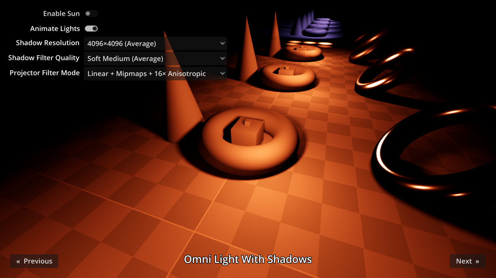

# 3D Lights and Shadows

This project showcases various 3D light and shadow features supported by Godot.
This includes contact-hardening shadows (PCSS) and light projectors.

The background sky uses a PhysicalSkyMaterial, which allows for the sky colors
to be automatically adjusted as the sun performs a day/night cycle. The radiance
map (used to provide ambient and reflected light to the scene) is updated in
real-time with the environment sky's process mode set accordingly.

Language: GDScript

Renderer: Forward+

Check out this demo on the asset library: https://godotengine.org/asset-library/asset/2741

## Screenshots

