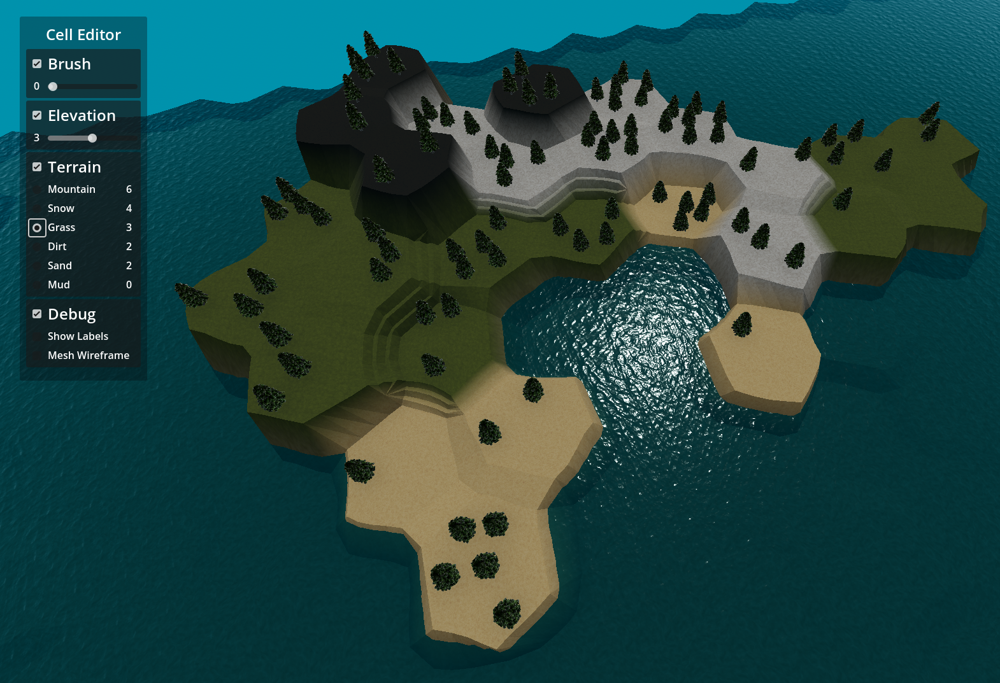

# Map Mesh Editor

This project showcases the features of Godot that enable runtime mesh generation and alteration, in this case to generate a Hex-Grid Map with editing capabilties.

The strategy for generating this Hex-Grid map and the approach to editing is heavily based off the resources provided by [CatLikeCoding](https://catlikecoding.com/unity/tutorials/hex-map), with some variation to suit requirement's for Godot as CatLikeCoding's tutorials are geared for Unity.

- Generating an initial grid-based mesh on scene start
- Modifying mesh data on user-input / interaction, allowing the change of a 'tile':
	- Elevation
	- Surface texture
	- Visual features / props
- Texturing a mesh surface using a TextureArray and applying textures based on splatmap practices.

Language: GDScript

Renderer: Forward Plus

## Screenshots

