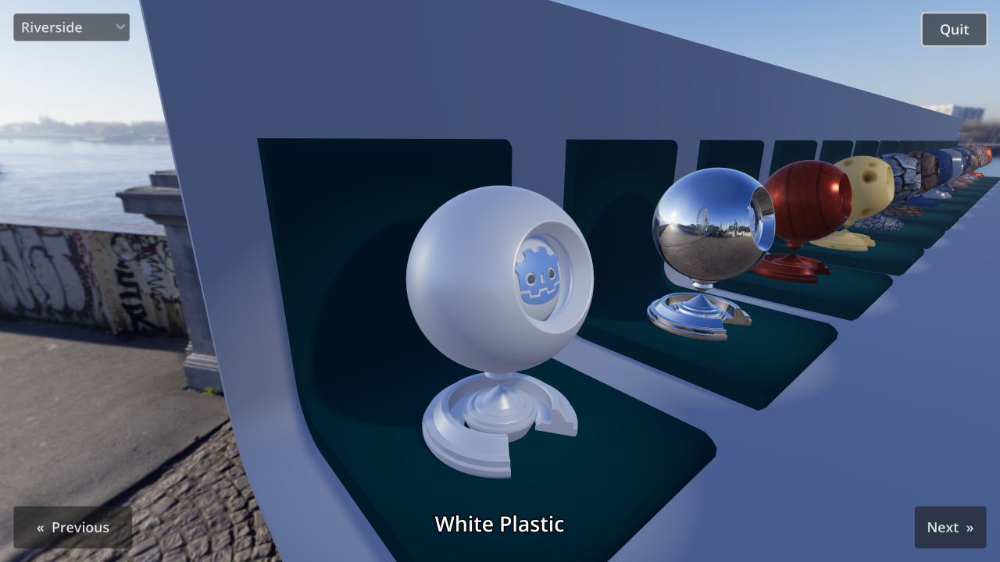

# Material Testers

This demo includes many sphere-like objects with complex materials,
for the purpose of showcasing Godot's rendering capabilities.

This demo was featured at the beginning of the
[Godot 3.0 trailer](https://www.youtube.com/watch?v=XptlVErsL-o).

Language: GDScript

Renderer: Forward Plus

Check out this demo on the asset library: https://godotengine.org/asset-library/asset/123

## Screenshots

