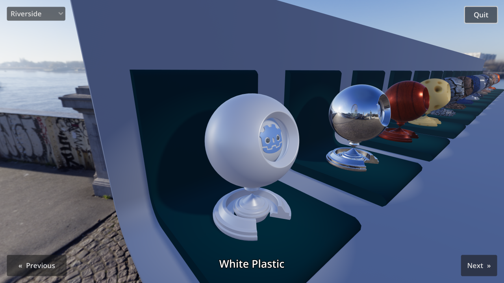

# Material Testers

This demo includes many sphere-like objects with complex materials,
for the purpose of showcasing Godot's rendering capabilities.

This demo was featured at the beginning of the
[Godot 3.0 trailer](https://www.youtube.com/watch?v=XptlVErsL-o).

Language: GDScript

Renderer: Forward+

Check out this demo on the Asset Store: https://store.godotengine.org/asset/godot-foundation/material-testers-demo/

## Screenshots

