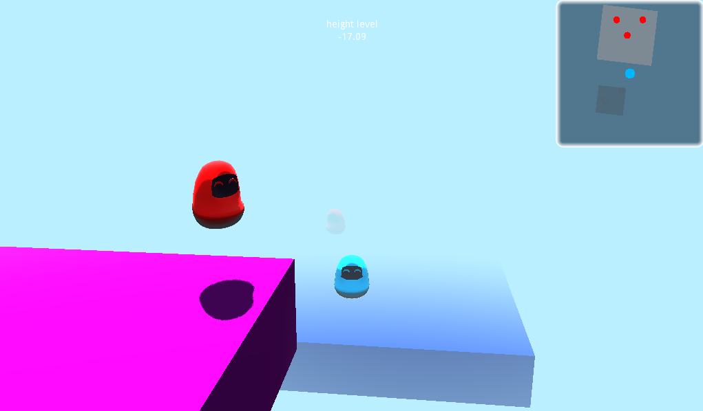

# 3D Minimap Radar

Demo for Minimap / Radar overlay using renderlayers and viewport camera.
Can be used for both common corner minimap or peeping radar like in alien vs predator games.
Works for both horizontal and vertical placement of environment objects and actors.

Language: GDScript

Renderer: GLES 2

## Screenshots

