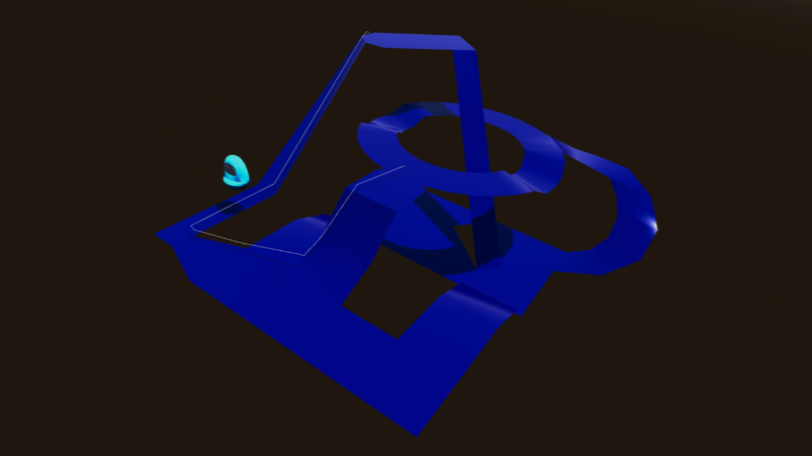

# 3D Navigation

Navigation demo for 3D scenes, with a character
able to pathfind around a static 3D environment.
The navigation path is drawn using a line.
Code is provided for polyline following in 3D.

Language: GDScript

Renderer: Compatibility

Check out this demo on the asset library: https://godotengine.org/asset-library/asset/2743

## Screenshots

