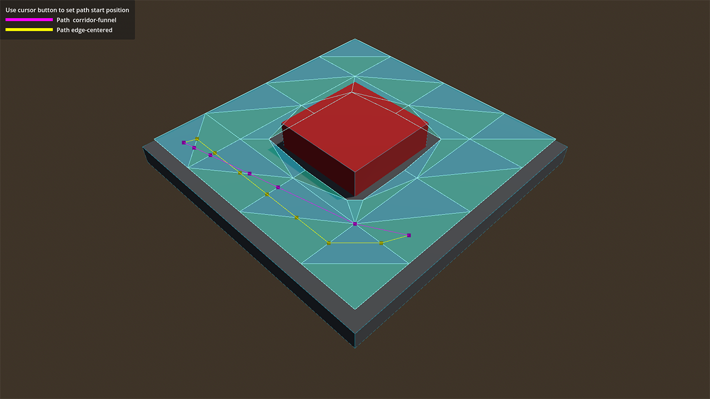

# Navigation Mesh Chunks 3D

Demo that shows how to bake navigation meshes for large world chunk systems.

A mouse cursor left click changes the start position for the debug paths.

Language: GDScript

Renderer: Compatibility

> Note: this demo requires Godot 4.3 or later

## Screenshots

